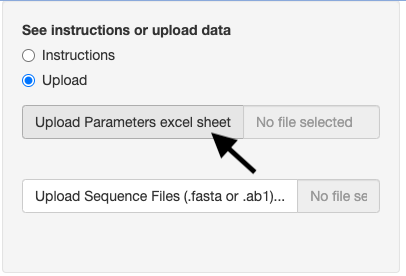
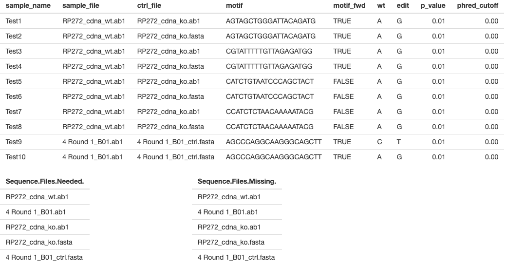
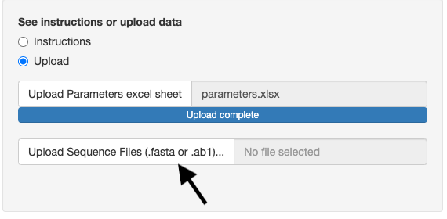
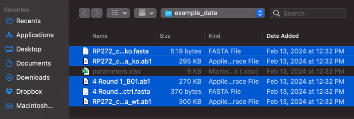
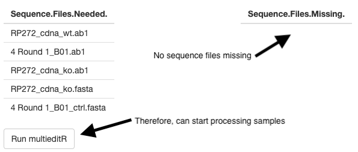
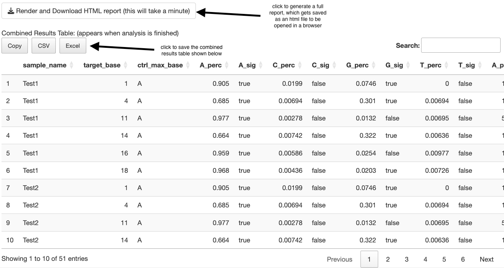
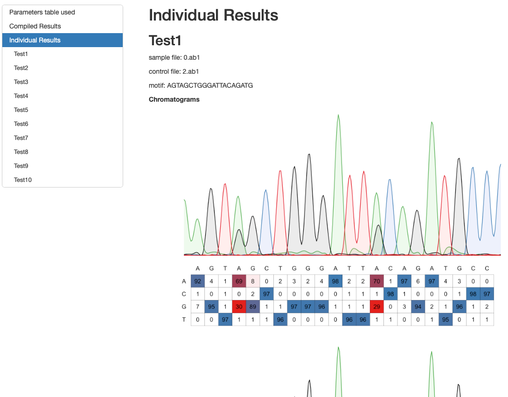

MultieditR is software developed by Mitch Kleusner and packaged by Jeremy M. Chacón. It detects specified single-nucleotide variant edits in specified motifs in Sanger sequences, compared to a control Sanger sequence. It was designed with the intent of detecting whether a crispR base edit was successful.

MultieditR can detect edits in all samples at once, and produce a downloadable html report with the results.

This functionality is also present in the R package multieditR using detect_edits_batch(), if you prefer a command-line solution.

# Requirements

1. A **parameters excel spreadsheet** with one row per sample, and the following columns, which must be present. Note: this software expects the header row to be in place, and correctly named. The example parameters table below can be copied or downloaded to use as a skeleton for your own samples.

2. For **each test (row in the spreadsheet), you need two files**. The sample file (which may have an edit) must be a Sanger sequence in .ab1 format. The control file, which should be the WT genotype, can be provided either as a Sanger sequence (.ab1) or simply as a fasta file (.fa, .fasta). This is designed to function on sequences around the length of Sanger sequences, so using long fastas is discouraged. If one file is used repeatedly, it only needs to be uploaded once. 

Warning: All sequence files must be in a single directory. This is required to facilitate uploading.

# Upload steps and download of results

1. First, upload the parameters excel spreadsheet using the button labeled “Upload Parameters excel sheet”



Once uploaded, the top ten rows of the spreadsheet will be shown on the main panel, to ensure the data are as expected (see example just below). Make sure the column names match what is expected, as well as the values. Make sure you do not use full paths to the files, just their names.




The app will determine what files are needed to run the software, and will show these in a table called “Sequence Files Needed” (bottom-left in above screenshot).

2. Second, upload the sequence files listed in the table. This must be done in a single step, by highlighting all of the relevant files (see screenshot below). Therefore, place the files into a single directory before attempting to upload.





The app will then check whether all of the sequence files needed were uploaded. If any are missing, they will be shown in the tabled labeled “Missing Sequence Files.” Make sure all of your sequence files are in the same directory so they can be uploaded at once. Clicking the upload link again will not store previously-uploaded files, hence why they all must be uploaded in one step.



WARNING: The control sequence, if .fa, should be roughly the same size as the sample sanger sequence. It is not designed to accept whole chromosomes, and will likely fail if attempted. 

3. Click “run multieditR”. This will start the analysis process. Each individual sample takes a few seconds, so you may need to wait a couple of minutes, depending on the size of your dataset.

Once the batch analysis is done, two things will occur: a combined, downloadable results table will be shown; and above that a button to download an html report with your analysis results as well as chromatograms per-sample. The first screenshot below shows the top of the combined results table and where to click the download button. WARNING: it takes a couple of minutes to render per 10 samples or so.

The second screenshot shows what an individual sample chromatogram looks like when the HTML report is opened in a web browser.





# Example Data

## Parameter Columns in Excel Spreadsheet


- sample_name : a unique ID for that sample (e.g. sample_1)
- sample_file : the name of the sample file which may contain an edit (e.g. test_file_1.ab1)
- ctrl_file : the name of the control file which shouldn’t have the edits (e.g. ctrl_file_1.ab1, or ctrl_file_1.fa)
- motif : the specific DNA sequence within which to detect edits. This should be a subset of the entire sequence in the fasta. It must follow IUPAC DNA naming (e.g. AGTACTGGGATTACAGATG)
- motif_fwd : whether the motif is in the same orientation as the sample Sanger sequence. If FALSE, it will be reverse-complimented before edit detection. 
- wt : the base that edits are expected to occur upon (e.g. A)
- edit : the base that the edits are expected to convert wt into (e.g. G)
- p_value : the threshold for which a detected edit is deemed significant (default = 0.01)
- phred_cutoff : pvalue threshold for base detection / trimming. Lower is more stringent (default = 0.001)

Here is an example parameters spreadsheet. Please note the COPY and EXCEL buttons which will allow you to use it as a skeleton for your own samples.

```{r echo = FALSE}
DT::datatable(readxl::read_excel("www/parameters.xlsx"),
                options = list(
    dom = 'Bfrtip',  # Enable buttons
    buttons = c('copy', 'excel'),  # Specify buttons
    pageLength = 5  # Display only 5 rows per page
  ),
  extensions = 'Buttons')
```

## Example Dataset (can be used in this app)

[Download example dataset](www/multieditr_batch_example_dataset.zip)

Click the button below to download a zip file containing a parameters excel spreadsheet and all of the sequence files required for those parameters. Then, after unzipping, you can use them on the upload page to try out the functionality, or as a positive control in case your own data are acting funny.